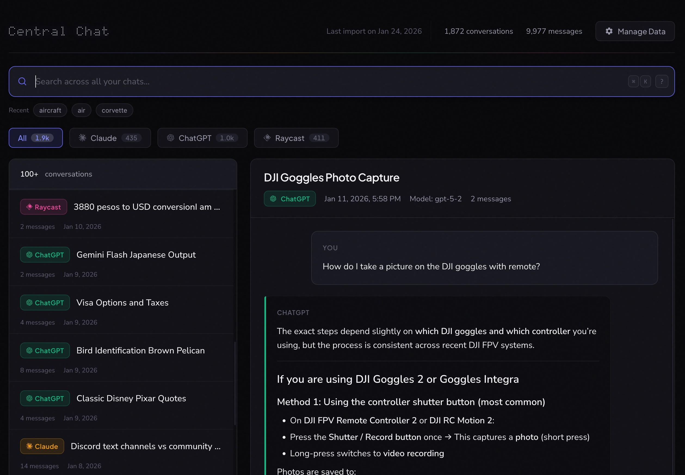
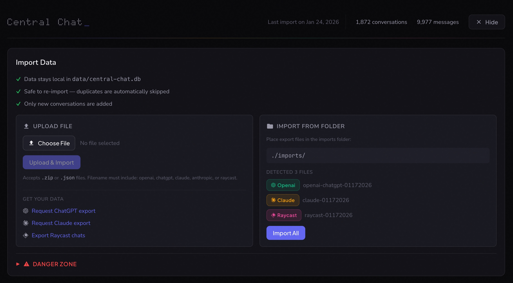
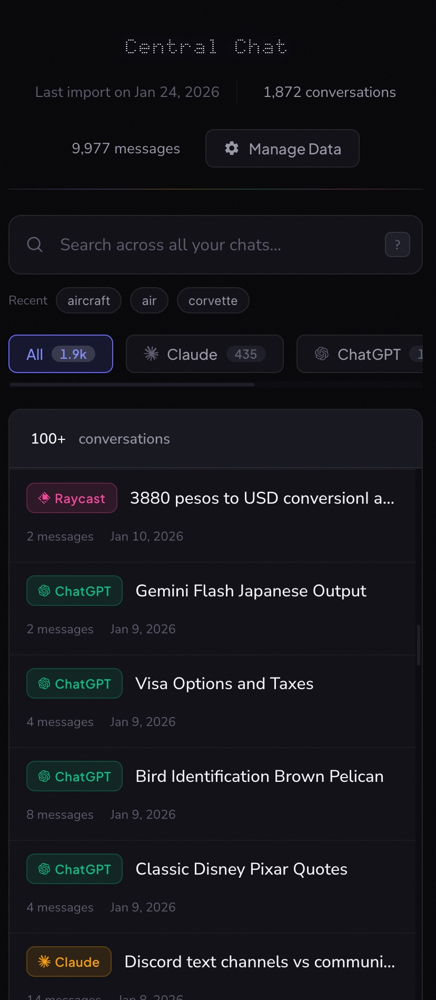

# Central Chat - Because that brilliant explanation ChatGPT or Claude gave you three months ago shouldn't be lost forever.


[](LICENSE)
[](https://docs.docker.com/get-docker/)
[](https://www.python.org/)
[](https://www.typescriptlang.org/)

Grab your data archives and get one search bar for everything. Every AI conversation. Zero cloud dependencies. Your conversations are scattered across ChatGPT, Claude, and Raycast—Central Chat brings them together in a single, fast, searchable interface that runs entirely on your machine. **Your data never leaves your computer.**

## Features

- **Unified search** across all platforms with SQLite FTS5
- **Platform theming** — Claude (amber), ChatGPT (teal), Raycast (rose)
- **Privacy-first** — all data stays local in a SQLite database
- **Safe re-imports** — duplicates are automatically skipped
- **Deep linking** — shareable URLs for each conversation
- **Keyboard-driven** — `Cmd+K` to search, `↑↓` to navigate, `?` for help
- **Syntax highlighting** — code blocks with one-click copy
- **Markdown rendering** — proper formatting for lists, headings, and more

## Quick Start

### Prerequisites

- **Docker** (recommended), OR
- Python 3.10+ and Node.js 18+

### Step 1: Get Your Data

Export your chat history from each platform you use:

| Platform | How to Export |
|----------|---------------|
| **ChatGPT** | [chat.openai.com](https://chat.openai.com) → Settings → Data Controls → Export → Download ZIP |
| **Claude** | [claude.ai/settings](https://claude.ai/settings) → Export Data → Download ZIP |
| **Raycast** | Use [raycast-ai-exporter](https://github.com/daveonkels/raycast-ai-exporter) to export your AI chat history |

### Step 2: Run the App

```bash
git clone https://github.com/daveonkels/centralchat.git
cd central-chat
docker compose up -d
```

Open [http://localhost:3000](http://localhost:3000)

### Step 3: Import Your Data

1. Click **Manage Data** in the header
2. Upload your exported ZIP or JSON files
3. Click **Upload & Import**

That's it! Your conversations are now searchable.

## Searching

- Type to search across all messages and conversation titles
- Filter by platform using the filter buttons
- Click a result to view the full conversation

**Search operators:**
- `platform:claude` — filter by platform (claude, openai, raycast)
- `role:user` — filter by message role (user, assistant)
- `before:2024-01-01` — messages before a date

**Keyboard shortcuts:** Press `?` to see all shortcuts

## Screenshots







## Tech Stack

| Layer | Technology |
|-------|------------|
| Frontend | React, TypeScript, Vite |
| Backend | Python, FastAPI |
| Database | SQLite with FTS5 full-text search |
| Deployment | Docker, nginx |

## Advanced Setup

<details>
<summary><strong>Manual Setup (without Docker)</strong></summary>

### Backend

```bash
cd backend
python3 -m venv .venv
source .venv/bin/activate
pip install -r requirements.txt

export DATABASE_PATH=../data/central-chat.db
export IMPORTS_PATH=../imports

uvicorn app.main:app --reload --port 8000
```

### Frontend

```bash
cd frontend
npm install
npm run dev
```

</details>

<details>
<summary><strong>Server Deployment (Traefik)</strong></summary>

For deployment to a server with an existing Traefik + Docker Compose setup:

### 1. Copy project and build images

```bash
rsync -avz --exclude 'node_modules' --exclude '.venv' --exclude 'data/*.db' --exclude '.git' \
  ./ yourserver:~/apps/central-chat/

ssh yourserver
cd ~/apps/central-chat
docker build -t central-chat-backend:latest ./backend
docker build -t central-chat-frontend:latest ./frontend
```

### 2. Create data directories

```bash
mkdir -p ~/data/central-chat/imports
```

### 3. Add to your docker-compose.yml

```yaml
central-chat-backend:
  image: central-chat-backend:latest
  container_name: central-chat-backend
  restart: unless-stopped
  volumes:
    - ~/data/central-chat:/app/data
    - ~/data/central-chat/imports:/app/imports:ro
  environment:
    - DATABASE_PATH=/app/data/central-chat.db
    - IMPORTS_PATH=/app/imports
  networks:
    - proxy

central-chat-frontend:
  image: central-chat-frontend:latest
  container_name: central-chat-frontend
  restart: unless-stopped
  depends_on:
    - central-chat-backend
  networks:
    - proxy
  labels:
    - "traefik.enable=true"
    - "traefik.http.routers.central-chat.rule=Host(`central-chat.example.com`)"
    - "traefik.http.routers.central-chat.entrypoints=https"
    - "traefik.http.routers.central-chat.tls=true"
    - "traefik.http.services.central-chat.loadbalancer.server.port=80"
    - "traefik.docker.network=proxy"
```

### 4. Start services

```bash
docker compose up -d central-chat-backend central-chat-frontend
```

</details>

## Data Storage

- **Database:** `data/central-chat.db`
- **Imports:** `imports/` directory
- Safe to delete the database and re-import at any time

## Supported Export Formats

| Platform | Expected File | Notes |
|----------|---------------|-------|
| ChatGPT | `conversations.json` | Full history with message tree structure |
| Claude | `conversations.json` | Full history with timestamps |
| Raycast | `raycast_ai_chats.json` | Simple format (no per-message timestamps) |

## API

| Endpoint | Description |
|----------|-------------|
| `GET /api/search?q=query` | Full-text search |
| `GET /api/conversations` | List conversations |
| `GET /api/conversations/{id}` | Get conversation with messages |
| `GET /api/conversations/stats` | Database statistics |
| `POST /api/import/run` | Trigger import |

## License

MIT
